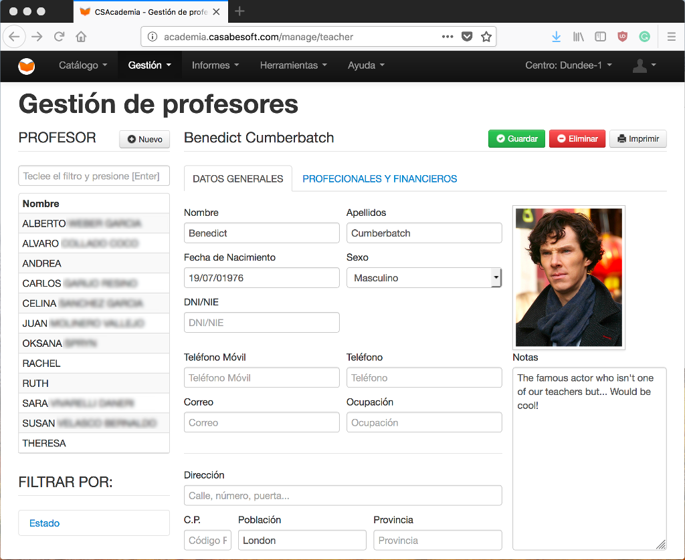

# CSAcademia - Academic management software 



CSAcademia is a tool to manage the student's and teacher's related information in an academy.

## History and present

This project started at the end of the summer of 2012 with a request from a potential client, wanting to replace their obsolete school management software.
The software starts functioning at the beginning of the academic course of 2013 and has been serving since then.
Now, it's an everyday tool for the [Dundee School of English](http://www.dundeeschool.com/) and we would like to see it in other schools.

If you want know more, [cointinue reading the history](docs/history.md).

## Setup

### Prerequisites

0. PHP >= 5.6
0. MySQL

### Dev tools

You can try doing it automatically running from the project base path:
```
$ bin/install.sh
```
If something goes wrong, try to install composer manually and then, from the project base path, run:
```
$ ./composer install
```

### DB config

0. From the project base path run:
    ```
    $ ./composer run-script db-init
    ```
0. Setup a user access to the database by optionally:
  - Editing the "user" and "password" config in the file _www/application/config/database.php_, or
  - Creating the default MySQL user "academia" with password "academia" (which you should change, later) and giving access to the "academia" database, created in the first step.

### Running the server

From the project base path run:
```
$ ./composer run-script www
```

## Contributions

Every contribution is welcome. Even if you don't know how to contribute but have an idea to improve or extend the functionality, the ideas are also welcome.

On the other hand, if you want to contribute but don't know where to start, checkout the list of [open issues](https://github.com/CasabeSoft/csacademia/issues).

### Code conventions

Please, be sure to check your code fallows the project code conventions which is, as for now, a relaxed version of [PSR-2](http://www.php-fig.org/psr/psr-2/). You have two composer script for that:
```
$ ./composer run-script php-lint # For a summary report
$ ./composer run-script php-lint-full # For a full and detailed report
```
The objective is to have 0 errors and _ideally_ 0 warnings so, if you want to see the details of an specific file, look at the full report (see above) or specify the path to the file to analyze it along:
```
$ ./composer run-script php-lint-full path/to/your/file.php
```
Regarding documentation you:
  * *must* document every non trivial public element
  * *should* document every non trivial protected element
  * *can* optionally document private elements which complexity seems to require it.
