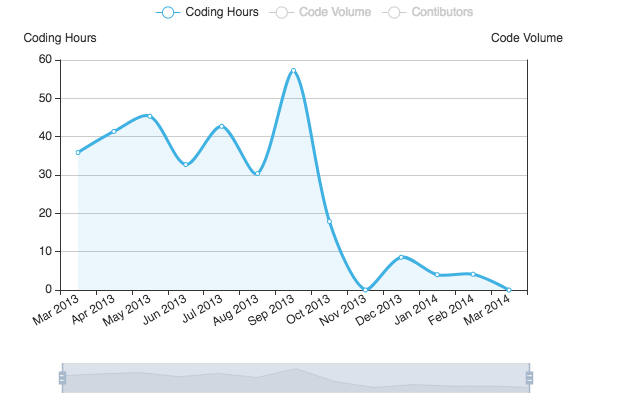

# CSAcademia History

This project started at the end of the summer of 2012 with a request from a potential client, wanting to replace their obsolete school management software.
We propose him a replacement solution with a release plan and a very adjusted budget.
Nevertheless, since the academic course has had recently started, we didn't get an agreement until the end of winter, in March 2013.

Then, the first commit went back to March, 12 of 2013.
During the next months, we worked an estimated average of 40 hours mainly at night and during the weekends.
Five months later, by the end of August, we had a functioning version of the software which started to replace the existing one in a parallel process that lasted a couple of months.
So, at the end of 2013, the software was completely functional and has been in use since then.

Codding effort during the first year (estimation by gitential.com)
